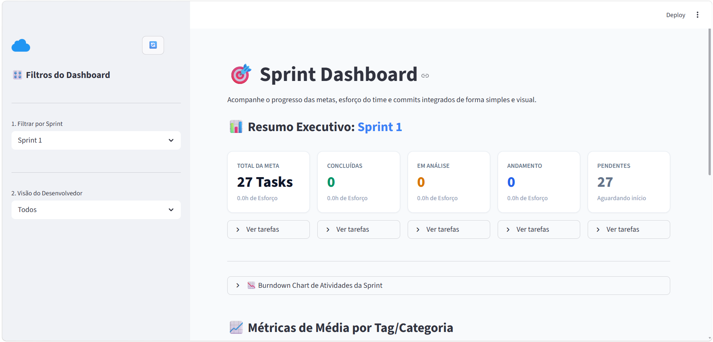

# 🎯 SprintView — Jira + GitHub

Dashboard em **Python + Streamlit** para acompanhamento da execução de Sprints.

O SprintView integra dados do **Jira Software** com commits de **múltiplos repositórios do GitHub**, permitindo acompanhar atividades, métricas, evolução e evidências de desenvolvimento em um único lugar.

---
## 🖥️ Tela do Projeto




## 🧠 Cenário

O projeto foi desenvolvido para equipes que utilizam **Jira Software + Scrum** e possuem uma estrutura como:

```
Sprint
├── Épico
│   ├── História
│   │   ├── Subtask
│   │   └── Subtask
│   ├── História
│   │   ├── Subtask
│   │   └── Subtask
│   └── ...
├── Task
├── Bug
└── outras atividades
```

Uma Sprint pode conter:

- **Épicos** → agrupam várias Histórias.
- **Histórias** → representam requisitos e contexto.
- **Subtasks** → atividades executáveis dentro de uma História.
- **Tasks, Bugs e outras atividades** → podem existir diretamente na Sprint.

 > **A Sprint é a unidade principal de análise. As atividades são o foco das métricas.**

 Épicos e Histórias fornecem contexto e organização, mas o dashboard prioriza o trabalho executável realizado durante a Sprint.

---

### 🔄 Fluxo de trabalho

 O SprintView considera o fluxo de trabalho padrão utilizado no quadro Scrum do Jira para representar a evolução das atividades durante a Sprint:

```
A fazer
   ↓
Em Andamento
   ↓
Em Análise
   ↓
Finalizado
```

 Cada status representa uma etapa do ciclo de execução:

 - **A fazer** → atividade planejada para a Sprint, mas que ainda não foi iniciada.
- **Em Andamento** → atividade que está sendo executada pelo desenvolvedor.
- **Em Análise** → atividade concluída em desenvolvimento e aguardando análise, validação ou revisão.
- **Finalizado** → atividade que passou pelo fluxo de execução e foi concluída.

 Esse fluxo permite que o SprintView acompanhe não apenas **quais atividades existem na Sprint**, mas também **em qual etapa de execução cada atividade se encontra**.

 Assim, as métricas do dashboard podem utilizar o status da atividade para representar a evolução da Sprint e diferenciar o que foi planejado, o que está em execução, o que está em análise e o que já foi finalizado.

 > **O status representa o estágio da atividade no fluxo Scrum. A evidência de execução é complementada por Worklogs, Changelogs e commits relacionados no GitHub.**

## 🔗 Jira + GitHub

O relacionamento entre Jira e GitHub utiliza a **Issue Key nativa fornecida pelo Jira**.

Exemplo:

```
Jira:
ELEM-123
```

 O desenvolvedor referencia essa chave no commit:

```
git commit -m "ELEM-123: Implementação da autenticação"
```

 O SprintView identifica a Issue Key e relaciona o commit à atividade correspondente.

 Não são utilizados IDs personalizados ou Regex para gerar identificadores.

---

## 📊 O que o SprintView acompanha?

- Atividades por Sprint.
- Status das atividades.
- Evolução da Sprint.
- Burndown.
- Worklogs.
- Changelogs.
- Commits relacionados.
- Desenvolvedores.
- Múltiplos repositórios.
- Histórico de Sprints.

---

## 🏗️ Visão geral

```
                    Sprint
                      │
          ┌───────────┴───────────┐
          │                       │
       Contexto              Atividades
          │                       │
    ┌─────┴─────┐          ┌──────┼──────┐
    │           │          │      │      │
  Épico      História     Task   Bug  Subtask
                │
                │
             Subtasks
                      │
                      ▼
                 Evidências
                      │
             ┌────────┼────────┐
             │        │        │
          Worklog  Changelog  GitHub
                               │
                             Commits
```

---

## ⚙️ Pré-requisitos

- 🐍 Python 3.8+
- 🔧 Git
- 🔑 Token de acesso ao Jira
- 🔑 Token de acesso ao GitHub

---

## 🚀 Instalação

### 1\. Clone o projeto

```
git clone https://github.com/ELEMENTARES-DSM/SprintView.git
cd SprintView
```

### 2\. Crie o ambiente virtual

#### Windows

```
python -m venv venv
venv\Scripts\activate
```

#### Linux / macOS

```
python3 -m venv venv
source venv/bin/activate
```

### 3\. Instale as dependências

```
pip install -r requirements.txt
```

---

## 🔑 Configuração

Crie um arquivo `.env` na raiz do projeto:

```
# Jira
EMAIL=seu_email@empresa.com
TOKEN=SEU_TOKEN_JIRA
JIRA_DOMAIN=sua-empresa.atlassian.net
BOARD_ID=2
JIRA_PROJECT=ELEM

# GitHub
GITHUB_TOKEN=SEU_TOKEN_GITHUB
GITHUB_ORG=sua-organizacao
```

 ### `JIRA_PROJECT`

 É a sigla do projeto no Jira.

 Exemplo:

```
Projeto: elementares-4sem
Sigla:   ELEM
```

---

## 🔐 Tokens

### Jira

https://id.atlassian.com/manage-profile/security/api-tokens

### GitHub

https://github.com/settings/personal-access-tokens

---

## ⚙️ `config.json`

Configure os repositórios do GitHub e o relacionamento entre usuários:

```
{
  "github": {
    "org": "sua-organizacao",
    "repos": [
      "backend",
      "frontend",
      "api"
    ]
  },
  "tipos_contexto": [
    "epic", 
    "story",
    "épico", 
    "história"
  ],
  "dev_mapping": {
    "usuario-github": "usuario-jira"
  }
}
```

### `github`

Exemplo:

```
"github": {
    "org": "ELEMENTARES-DSM",
    "repos": [
        "FRONTEND-4SEMESTRE",
        "BACKEND-4SEMESTRE",
        "API-4SEMESTRE"
    ]
},
```

---

### `tipos_contexto`

Define os tipos de atividades que devem ser ignorados na contagem de atividades dos desenvolvedores.

Exemplo:

```
"tipos_contexto": [
  "epic",
  "story",
  "épico",
  "história"
],
```

---

### `dev_mapping`

Relaciona o usuário do GitHub ao usuário utilizado pelo Jira.

Exemplo:

```
"dev_mapping": {
  "kakashinho": "joao-siqueira",
  "joaoomoura": "joão-moura"
}
```

---

## ▶️ Executar

```
streamlit run app.py
```

O Streamlit iniciará a aplicação localmente.

---

## 🧪 Debug

O SprintView possui recursos de diagnóstico para investigar problemas nas integrações e no relacionamento dos dados.

No dashboard:

```
🧪 Debug de Mapeamento Relacional
```

Os logs também utilizam identificadores de execução e operação para facilitar a localização de falhas.

Exemplo:

```
[RunID:6cc633a7]
[OpID:4fc1ed72]
```

---

## 📚 Histórico de Sprints

As Sprints anteriores fazem parte da análise.

O objetivo é permitir visualizar e comparar a evolução do trabalho ao longo do tempo:

```
Sprint 1 → atividades
Sprint 2 → atividades
Sprint 3 → atividades
Sprint 4 → atividades
Sprint atual → atividades
```

---

## 🚧 Status

**Em desenvolvimento.**

A arquitetura atual está sendo construída em torno de:

```
Sprint
  ↓
Atividades
  ↓
Contexto
  ↓
Evidências
  ↓
Histórico
```

O objetivo é fornecer uma visão simples e baseada em dados sobre:

 > **O que foi planejado, o que foi executado e quais evidências existem dessa execução.**

---

## 🎯 Objetivo

O SprintView busca centralizar informações que normalmente ficam separadas entre Jira e GitHub.

```
Jira
  │
  ├── Sprints
  ├── Atividades
  ├── Status
  ├── Worklogs
  └── Changelogs
        │
        ▼
    SprintView
        ▲
        │
  GitHub
  ├── Repositórios
  └── Commits
```

 **Jira mostra o trabalho registrado.\
 GitHub mostra evidências de desenvolvimento.\
 SprintView conecta essas informações para analisar a execução da Sprint.**